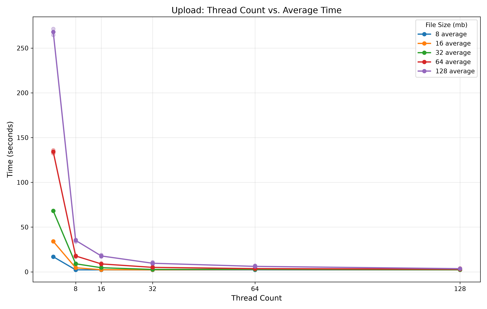

# Performance Analysis

## Upload: Thread Count vs. Average Time

This graph shows the average upload time for different file sizes as the number of threads increases. The time drops sharply from very low thread counts to moderate concurrency, especially for the larger files, which indicates that parallelizing chunk uploads reduces the bottleneck caused by per-request overhead and network serialization. After around 32–64 threads, the improvement starts to level off, suggesting the system is approaching a saturation point where additional threads provide less benefit.

## Download: Thread Count vs. Average Time

The download trend is very similar: more threads initially reduce retrieval time substantially, but the gains flatten out as concurrency grows. This is expected in a distributed storage setup where downloading many chunks in parallel improves throughput, but eventually the system becomes limited by network capacity, chunk coordination, or node contention. In practice, a moderate thread count appears to be the sweet spot, delivering most of the performance gain without paying the full cost of excessive parallelism.

Overall, both upload and download curves suggest that the application benefits from parallelism, but not linearly. The best trade-off appears to come from using a moderate number of worker threads rather than the maximum available, because the largest gains happen early and additional threads quickly yield diminishing returns.
